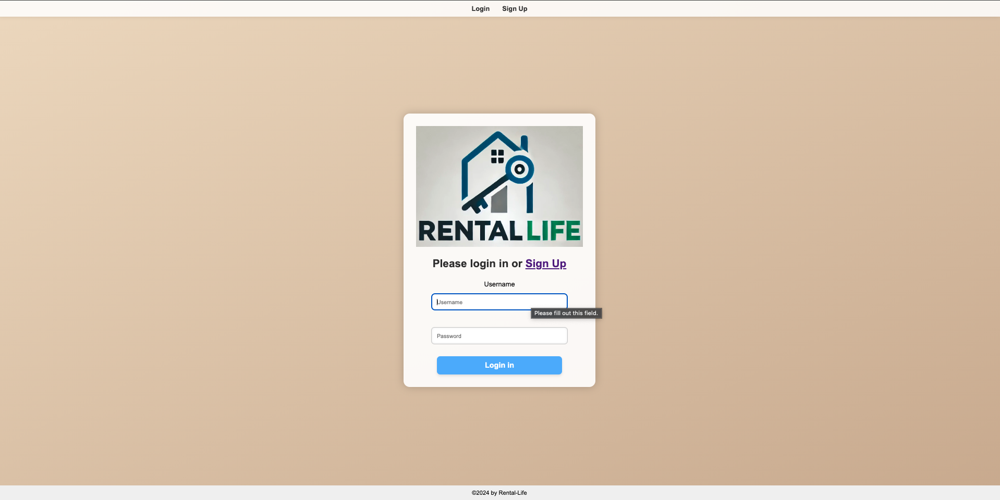
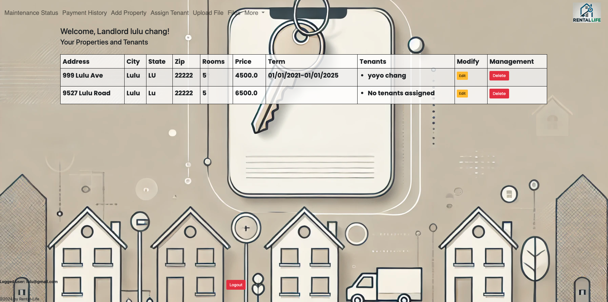
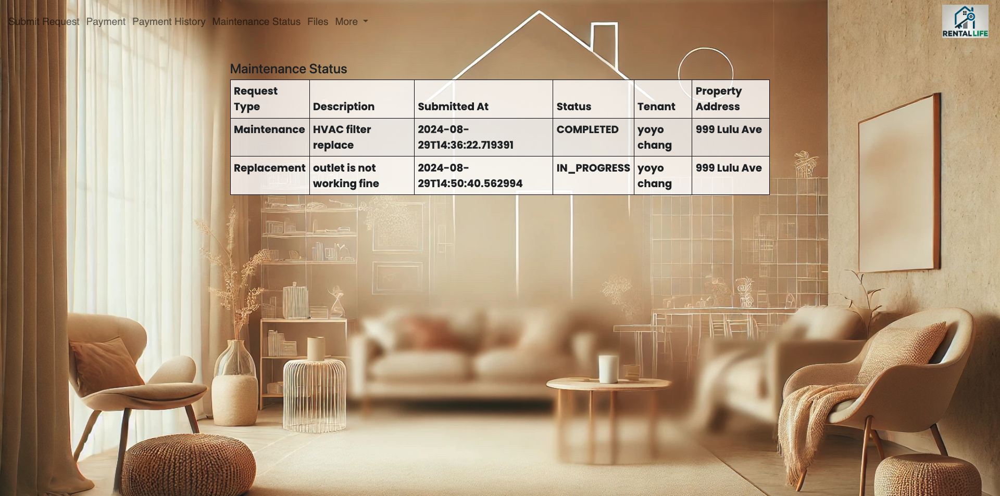

# RentalLife


## User Story
  
```
As a landlord,
I want to manage my properties and tenants on a centralized platform,
so that I can easily keep track of property details, tenant information, and handle various management tasks efficiently.

```

## Description
  This RentalLife was created by Spring Boot, Java
## Heroku_Link
[Click me](https://rentallife-heroku-90ae272989c9.herokuapp.com/)
## Screenshot





## Languages
  SpringBoot,Java,HTML,CSS,
## Contributing
  ChunYu Chang
## Reference
  1.Google <br />
  2.Class Moudles <br />
  3.ChatGPT <br />
  
## Questions
 Contact me<br />

## Contact
GitHub: [mr91217](https://github.com/mr91217)<br />
<br />
Email: mr91217@gmail.com<br />
<br />